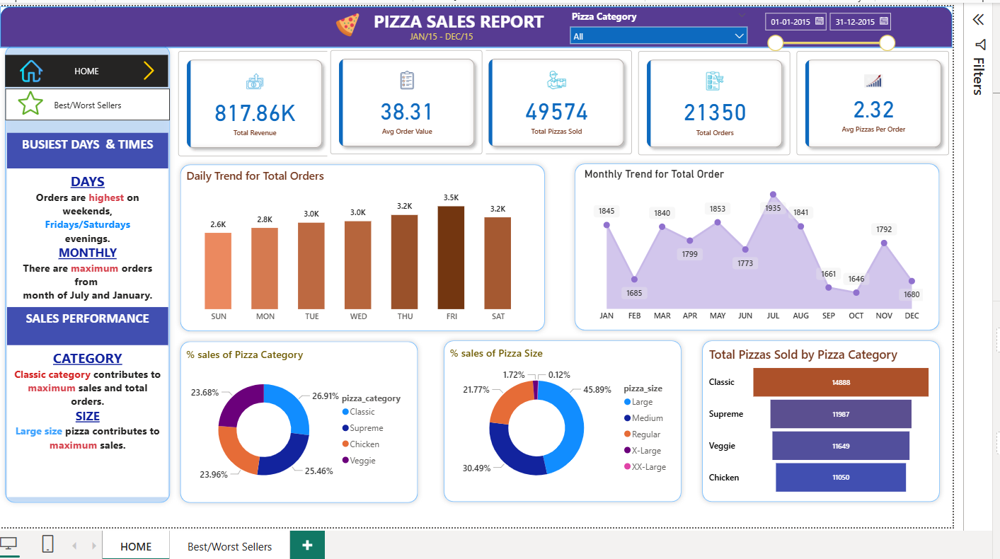
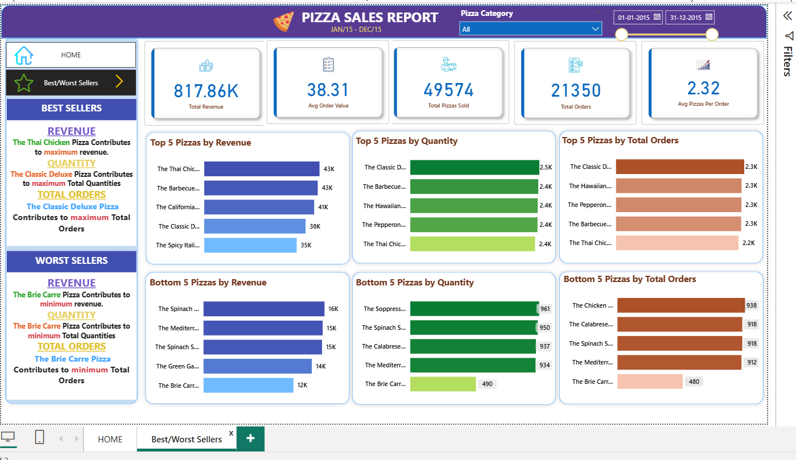

# Sales-Data-Analysis-PowerBI-SQL
🍕 Pizza Sales Analysis

## 📌 Project Overview

This project involves a detailed sales analysis for a pizza restaurant using *SQL* for data transformation and *Power BI* for visualization. The objective is to extract meaningful insights that can help the business improve customer satisfaction, optimize inventory, and boost revenue.

---

## 📊 Tools & Technologies Used

- *SQL* – For querying, cleaning, and analyzing data.
- *Power BI* – For designing interactive and insightful dashboards.
- *Excel/CSV* – For storing and manipulating raw data.
- *GitHub* – For version control and project showcase.

---

## 🧾 Dataset Description

The dataset contains transactional data from a pizza restaurant, including:

| Column Name | Description |
|-------------|-------------|
| pizza_id | Identifier of the pizza type |
| order_id  | Unique ID of each order |
| order_date | Date and time of the order |
| order_time | Time at which order was placed|
| name | Pizza name |
| category | Pizza category (Classic, Veggie, Chicken, etc.) |
| size | Size of the pizza (S, M, L, XL, XXL) |
| unit_price | Price of one unit |
| quantity | Quantity of each item ordered |
| pizza_ingredients | Ingridients used in pizza |
| total_price | Total price of the order |

---

## 🎯 Business Goals

- Identify the most and least popular pizzas.
- Discover peak sales days and hours.
- Understand monthly revenue trends.
- Determine which pizza sizes and categories are most profitable.
- Improve order forecasting and inventory management.
- Track performance of different pizza categories over time to optimize marketing and promotion strategies.
---
## Problem Statement: Pizza Sales Data Analysis
This project aims to analyze pizza sales data to gain insights into business performance and identify key trends. We will achieve this by calculating crucial Key Performance Indicators (KPIs) and visualizing various aspects of the sales data through a series of charts.

Our analysis will address the following specific requirements:

*KPI Requirements:
We need to calculate the following key metrics to understand our business performance:

Total Revenue: The sum of the total price of all pizza orders.

Average Order Value: The average amount spent per order, calculated by dividing the total revenue by the total number of orders.

Total Pizzas Sold: The sum of the quantities of all pizzas sold.

Total Orders: The total number of orders placed.

Average Pizzas Per Order: The average number of pizzas sold per order, calculated by dividing the total number of pizzas sold by the total number of orders.

## Charts Requirements:
We will visualize various aspects of our pizza sales data to gain insights and understand key trends through the following charts:

Daily Trend for Total Orders: Create a bar chart that displays the daily trend of total orders over a specific time period. This chart will help us identify any patterns or fluctuations in order volumes on a daily basis.

Monthly Trend for Total Orders: Create a line chart that illustrates the monthly trend of total orders throughout the period. This chart will allow us to identify peak hours or periods of high order activity.

Percentage of Sales by Pizza Category: Create a pie chart that shows the distribution of sales across different pizza categories. This chart will provide insights into the popularity of various pizza categories and their contribution to overall sales.

Percentage of Sales by Pizza Size: Generate a pie chart that represents the percentage of sales attributed to different pizza sizes. This chart will help us understand customer preferences for pizza sizes and their impact on sales.

Total Pizzas Sold by Pizza Category: Create a funnel chart that presents the total number of pizzas sold for each pizza category. This chart will allow us to compare the sales performance of different pizza categories.

Top 5 Best Sellers by Revenue, Total Quantity, and Total Orders: Create a bar chart highlighting the top 5 best-selling pizzas based on Revenue, Total Quantity, and Total Orders. This chart will help us identify the most popular pizza options.

Bottom 5 Best Sellers by Revenue, Total Quantity, and Total Orders: Create a bar chart showcasing the bottom 5 worst-selling pizzas based on Revenue, Total Quantity, and Total Orders. This chart will enable us to identify underperforming or less popular pizza options.

---
## Data Source

The project's analysis operates on a comprehensive pizza sales dataset, which will be included in this repository. The raw data contains precisely the columns specified by the project requirements. This dataset requires a methodical SQL-based Extract, Transform, Load (ETL) process to restructure it into a relational database schema that exclusively uses these provided column names for clarity and consistency, enabling robust analysis for Power BI reports.

**Original Raw Data Structure (Based on specified column list):**

The raw dataset contains the following exact column names and their conceptual content:

* **`pizza_id`**: (Integer) A unique identifier for each *line item* or *detail record* within the raw dataset.
* **`order_id`**: (Integer) The unique identifier for the overall customer order to which this pizza item belongs.
* **`pizza_name`**: (Text/Varchar) *[This refers to the **short, identifying name** for the pizza type, e.g., 'hawaiian'.]*
* **`quantity`**: (Integer) The number of pizzas of this specific item in the order.
* **`order_date`**: (Date) The date on which the order was placed.
* **`order_time`**: (Time) The time at which the order was placed.
* **`unit_price`**: (Decimal) The price of a single pizza of this specific type and size.
* **`total_price`**: (Decimal) The total price for this specific line item (i.e., `quantity` multiplied by `unit_price`).
* **`pizza_size`**: (Text/Varchar) The size of the pizza (e.g., 'S', 'M', 'L').
* **`pizza_category`**: (Text/Varchar) The general category of the pizza (e.g., 'Classic', 'Veggie', 'Chicken', 'Supreme').
* **`pizza_ingredients`**: (Text/Varchar) The list of ingredients for the pizza.

**Database Schema (Target Structure using ONLY Provided Column Names, with Necessary Distinction for Duplicates):**

To manage data efficiently and enable Power BI reports, the raw data will be transformed and loaded into the following interconnected tables. The column names directly reflect those provided, with a necessary distinction for the duplicated `pizza_name` to create a valid database structure.

* **`orders` Table:**
    * **Purpose:** To store unique information for each customer order.
    * **Columns:**
        * `order_id` (Primary Key, Integer): Directly mapped from the raw `order_id` column.
        * `order_date` (Date): Directly mapped from the raw `order_date` column.
        * `order_time` (Time): Directly mapped from the raw `order_time` column.

* **`order_details` Table:**
    * **Purpose:** To link specific orders to the individual pizza items within them. This table holds the granular details of each item sold in an order.
    * **Columns:**
        * `pizza_id` (Primary Key, Integer): Directly mapped from the raw `pizza_id` column. This serves as the unique line item identifier.
        * `order_id` (Foreign Key, Integer): Links to the `orders` table.
        * `quantity` (Integer): Directly mapped from the raw `quantity` column.
        * `total_price` (Decimal): Directly mapped from the raw `total_price` column.
        * `unit_price` (Decimal): Directly mapped from the raw `unit_price` column.
        * `pizza_size` (Text/Varchar): Directly mapped from the raw `pizza_size` column.
        * `pizza_category` (Text/Varchar): Directly mapped from the raw `pizza_category` column.
        * `pizza_name` (Text/Varchar): Mapped from the *short, identifying* `pizza_name` from the list.
        * `pizza_name_full_description` (Text/Varchar): Mapped from the *full, descriptive* `pizza_name` from the list. This distinction is required for a valid schema.
        * `pizza_ingredients` (Text/Varchar): Directly mapped from the raw `pizza_ingredients` column.

   This structured schema was later transformed using SQL to build a cleaned `order_details` table, optimized for Power BI visualizations and KPI tracking.

 ##  Methodology / Approach

The project followed a structured data analysis methodology, transitioning from raw, denormalized data to insightful visualizations:

1.  **Data Ingestion & Transformation (ETL Process):**
    * The raw pizza sales data , initially in a flat-file format, was conceptually ingested into a database environment.
    * **SQL-based ETL processes** were meticulously designed and executed to:
        * **Data Normalization:** The denormalized raw data was transformed and loaded into four structured tables: `orders`, `order_details`, `pizzas`, and `pizza_types`, as detailed in the "Data Source" section. This normalization ensures data integrity and efficiency for analytical queries.
        * **Data Type Conversion:** All relevant columns were cast to appropriate data types (e.g., DATE for `order_date`, TIME for `order_time`, DECIMAL for `price`, INTEGER for `quantity`) to ensure accurate calculations.

2.  **KPI Calculation:**
    * Advanced SQL queries were developed to compute the required Key Performance Indicators (KPIs) as outlined in the "Problem Statement" . These calculations, such as Total Revenue, Average Order Value, Total Pizzas Sold, Total Orders, and Average Pizzas Per Order, leveraged aggregate functions (SUM, AVG, COUNT) and JOIN operations across the newly normalized tables. The results are prominently displayed in Power BI dashboard's KPI cards.

3. **Data Preparation for Visualization:**
    * Specific SQL queries were crafted to aggregate and reshape data for each required chart. For example:
        * Daily and Monthly Trends for Total Orders required grouping by date.
        * Percentage of Sales by Pizza Category/Size required aggregation by these dimensions.
        * Top/Bottom 5 Best Sellers required ordering and limiting results.
    * These prepared datasets served as the foundation for the Power BI visualizations.
 ## 🗂️ Project Assets

The following folders contain supporting visuals and outputs for the project. You can explore them directly in the repository:

- 📊 [`dashboard_preview/`](assets/dashboard_preview/) — Power BI dashboard preview images.
- 📈 [`trend_analysis/`](assets/trend_analysis/) — Trend graphs and visualizations.  
- 📌 [`kpi-images/`](assets/kpi-images/) — KPI visuals.  
- 🗃️ [`Sales_Insights/`](assets/Sales_Insights/) — Output screenshots from SQL queries and other insights.

**Interactive Dashboard Development:**
    * Power BI was utilized to create a comprehensive and interactive dashboard. This involved importing the SQL-prepared data and designing various chart types (bar charts for trends and best sellers, pie charts for percentages, and KPI cards) to visually represent all insights and allow for easy exploration of sales patterns.

## 📈 Dashboard Preview

> Below is a glimpse of the Power BI dashboards used to visualize insights:

## 📊 Power BI Dashboards

  

 

  

## Features
- End-to-end SQL pipeline from raw data to clean dataset
- Power BI dashboard with slicers and KPIs
- Pizza-wise, category-wise, and daily sales breakdown
---

## 🧠 Learnings

- Practiced advanced SQL querying and data aggregation.
- Developed impactful visual storytelling with Power BI.
- Understood business KPIs from a sales and inventory perspective.
## Conclusion
This project provided valuable insights into pizza sales trends by leveraging SQL for data transformation and Power BI for interactive visualization. Key performance metrics, customer preferences, and product-level patterns were successfully uncovered. [For an in-depth analysis, please refer to the attached PDF report](report/Pizza_Sales_Analysis_Report.docx)

